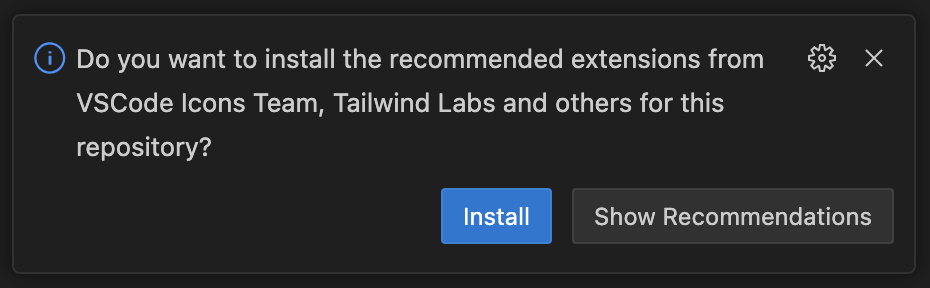
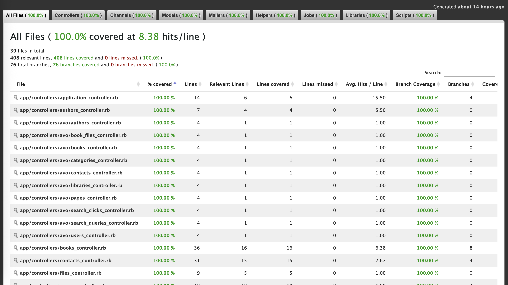

<h1 dir="rtl">الجامع</h1>

مكتبة المكتبات الإسلامية

<h2 dir="rtl">تجهيز بيئة التطوير</h2>

<ol dir="rtl">
  <li>ثبّت <code>Docker</code> حسب نظام تشغيلك من خلال <a href="https://docs.docker.com/engine/install/">هذا</a> الرابط.</li>
  <li>ثبّت <code>Mise</code> حسب نظام تشغيلك من خلال <a href="https://mise.jdx.dev/installing-mise.html">هذا</a> الرابط.</li>
  <li>ثبّت مكتبة <code>libpq</code> حسب نظام تشغيلك. على سبيل المثال، نفّذ هذا الأمر إذا كنت تستخدم نظام MacOS:</li>

  <pre dir="ltr">brew install libpq</pre>

  <li>أضِف مكتبة <code>libpq</code> إلى متغير <code>PATH</code> حسب نظام تشغيلك باتباع التعليمات الموضّحة بعد تثبيت المكتبة. على سبيل المثال، نفّذ هذا الأمر إذا كنت تستخدم نظام MacOS مع <code>Zsh</code>:</li>

  <pre dir="ltr">echo 'export PATH="/opt/homebrew/opt/libpq/bin:$PATH"' >> /Users/{user}/.zshrc</pre>

  <li>نفّذ الأمر التالي لنسخ مستودع المشروع إلى حاسبك:</li>

  <pre dir="ltr">git clone git@github.com:ieasybooks/aljam3.git</pre>

  <li>افتح سطر الأوامر داخل مجلد المشروع ونفّذ الأمر التالي لتثبيت أدوات <code>Mise</code> المطلوبة للتطوير:</li>

  <pre dir="ltr">mise install</pre>

  <li>نفّذ الأمر التالي لتثبيت اعتماديات المشروع وتشغيل خادم التطوير المحلّي:</li>

  <pre dir="ltr">mise dev</pre>

  <li>افتح الرابط <a href="http://localhost:3000"><code>http://localhost:3000</code></a> في متصفحك للوصول إلى الصفحة الرئيسية للمشروع.</li>
</ol>

ستحصل على الأدوات التالية باتباعك للخطوات المذكورة أعلاه:

<ul>
  <li><a href="https://docker.com">Docker</a></li>
  <li><a href="https://mise.jdx.dev">Mise</a></li>
  <li><a href="https://postgresql.org/docs/current/libpq.html">libpq</a></li>
  <li><a href="https://ruby-lang.org">Ruby</a> (3.4.4)</li>
  <li><a href="https://rubyonrails.org">Rails</a> (8.0.2)</li>
  <li><a href="https://nodejs.org">Node.js</a> (24.1.0)</li>
  <li><a href="https://yarnpkg.com">Yarn</a> (4.9.1)</li>
  <li><a href="https://postgresql.org">PostgreSQL</a> (17.5)</li>
  <li><a href="https://meilisearch.com">Meilisearch</a> (1.14.0)</li>
</ul>

كما يمكنك الوصول إلى PostgreSQL و Meilisearch من خلال المنافذ التالية:

<ul>
  <li>PostgreSQL → 5433 (localhost:5433)</li>
  <li>Meilisearch → 7701 (localhost:7701)</li>
</ul>

وبمجرّد إيقاف تشغيل خادم التطوير المحلّي من خلال الضغط على <code>Cmd+C</code> أو <code>Ctrl+C</code>، ستتوقف خدمات <code>Docker</code> (PostgreSQL و Meilisearch) عن العمل تلقائيًا.

<h2 dir="rtl">تجهيز المحرر</h2>

أُعِدّ هذا المشروع ليعمل مع محرر VSCode أو ما يشبهه من المحررات مثل Cursor و Windsurf وغيرهما. بمجرّد فتح المشروع في أحد هذه المحررات سيظهر لك إشعار شبيه بالإشعار الموضّح في الصورة يسألك "هل تريد تثبيت الإضافات المُوصى بها؟"، وإذا ضغطت على زر Install ستبدأ عملية تثبيت الإضافات الموجودة في ملف <a href=".vscode/extensions.json"><code dir="ltr">.vscode/extensions.json</code></a>.

  

الإضافات المُوصى بها:

<ul>
  <li><a href="https://marketplace.visualstudio.com/items?itemName=Shopify.ruby-lsp">Ruby LSP</a></li>
  <li><a href="https://marketplace.visualstudio.com/items?itemName=aki77.rails-db-schema">Rails DB Schema</a></li>
  <li><a href="https://marketplace.visualstudio.com/items?itemName=aki77.rails-i18n">Rails I18n</a></li>
  <li><a href="https://marketplace.visualstudio.com/items?itemName=bradlc.vscode-tailwindcss">Tailwind CSS IntelliSense</a></li>
  <li><a href="https://marketplace.visualstudio.com/items?itemName=bung87.vscode-gemfile">vscode-gemfile</a></li>
  <li><a href="https://marketplace.visualstudio.com/items?itemName=eamodio.gitlens">GitLens — Git supercharged</a></li>
  <li><a href="https://marketplace.visualstudio.com/items?itemName=marcoroth.stimulus-lsp">Stimulus LSP</a></li>
  <li><a href="https://marketplace.visualstudio.com/items?itemName=ms-vscode.live-server">Live Preview</a></li>
  <li><a href="https://marketplace.visualstudio.com/items?itemName=mtxr.sqltools">SQLTools</a></li>
  <li><a href="https://marketplace.visualstudio.com/items?itemName=mtxr.sqltools-driver-pg">SQLTools PostgreSQL/Cockroach Driver</a></li>
  <li><a href="https://marketplace.visualstudio.com/items?itemName=vscode-icons-team.vscode-icons">vscode-icons</a></li>
  <li><a href="https://marketplace.visualstudio.com/items?itemName=waderyan.gitblame">Git Blame</a></li>
</ul>

كما أن إعدادات جميع هذه الإضافات موجودة مسبقًا في ملف <a href=".vscode/settings.json"><code dir="ltr">.vscode/settings.json</code></a>، لذا لا داعي لإعدادها يدويًّا.

<h2 dir="rtl">المكتبات المستخدمة للغة Ruby</h2>

<h3 dir="rtl">المكتبات المُضافة</h3>

<em>ملاحظة: جميع المكتبات المُضافة يجب أن تكون مُحددة بإصدار مُعيّن.</em>

<h4 dir="rtl">مكتبات المصادقة والأمان</h4>
<ul dir="rtl">
  <li><strong><a href="https://github.com/heartcombo/devise">devise</a></strong> - نظام مصادقة شامل للمستخدمين يوفر تسجيل الدخول والخروج وإدارة كلمات المرور</li>
  <li><strong><a href="https://github.com/tigrish/devise-i18n">devise-i18n</a></strong> - ترجمات متعددة اللغات لمكتبة Devise</li>
  <li><strong><a href="https://github.com/omniauth/omniauth">omniauth</a></strong> - إطار عمل للمصادقة عبر خدمات خارجية متعددة</li>
  <li><strong><a href="https://github.com/zquestz/omniauth-google-oauth2">omniauth-google-oauth2</a></strong> - مصادقة عبر حسابات Google</li>
  <li><strong><a href="https://github.com/cookpad/omniauth-rails_csrf_protection">omniauth-rails_csrf_protection</a></strong> - حماية من هجمات CSRF لمكتبة OmniAuth</li>
  <li><strong><a href="https://github.com/rack/rack-attack">rack-attack</a></strong> - حماية من الهجمات والحد من معدل الطلبات</li>
  <li><strong><a href="https://github.com/instrumentl/rails-cloudflare-turnstile">rails_cloudflare_turnstile</a></strong> - تكامل مع خدمة Cloudflare Turnstile للحماية من الهجمات</li>
</ul>

<h4 dir="rtl">مكتبات البحث والأداء</h4>
<ul dir="rtl">
  <li><strong><a href="https://github.com/meilisearch/meilisearch-rails">meilisearch-rails</a></strong> - محرك بحث سريع ومرن مع تكامل Rails</li>
  <li><strong><a href="https://github.com/salsify/goldiloader">goldiloader</a></strong> - تحسين استعلامات قاعدة البيانات وتقليل مشكلة N+1</li>
  <li><strong><a href="https://github.com/ddnexus/pagy">pagy</a></strong> - مكتبة ترقيم صفحات سريعة وخفيفة</li>
  <li><strong><a href="https://github.com/ohler55/oj">oj</a></strong> - معالج JSON سريع وفعال</li>
</ul>

<h4 dir="rtl">مكتبات واجهة المستخدم</h4>
<ul dir="rtl">
  <li><strong><a href="https://github.com/yippee-fun/phlex-rails">phlex-rails</a></strong> - إطار عمل لبناء مكونات HTML باستخدام Ruby</li>
  <li><strong><a href="https://github.com/AliOsm/phlex-icons">phlex-icons</a></strong> - مجموعة أيقونات لاستخدامها مع Phlex</li>
  <li><strong><a href="https://github.com/ruby-ui/ruby_ui">ruby_ui</a></strong> - مكونات واجهة مستخدم جاهزة للاستخدام متوافقة مع Phlex</li>
  <li><strong><a href="https://github.com/gjtorikian/tailwind_merge">tailwind_merge</a></strong> - دمج فئات Tailwind CSS بذكاء</li>
  <li><strong><a href="https://github.com/svenfuchs/rails-i18n">rails-i18n</a></strong> - ترجمات Rails الأساسية للغات متعددة</li>
</ul>

<h4 dir="rtl">مكتبات التطوير والاختبار</h4>
<ul dir="rtl">
  <li><strong><a href="https://github.com/sporkmonger/addressable">addressable</a></strong> - مكتبة بديلة ومرنة لمعالجة وتحليل عناوين URI (تُستخدم في <code dir="ltr">lib/tools/import_books.rb</code> فقط)</li>
  <li><strong><a href="https://github.com/drwl/annotaterb">annotaterb</a></strong> - إضافة تعليقات توضيحية تلقائية لنماذج Rails</li>
  <li><strong><a href="https://github.com/BetterErrors/better_errors">better_errors</a></strong> - صفحات أخطاء محسنة أثناء التطوير</li>
  <li><strong><a href="https://github.com/banister/binding_of_caller">binding_of_caller</a></strong> - تحسين تجربة مكتبة <strong>better_errors</strong></li>
  <li><strong><a href="https://github.com/faker-ruby/faker">faker</a></strong> - توليد بيانات وهمية لأغراض التطوير والاختبار</li>
  <li><strong><a href="https://github.com/hotwired/spark">hotwire-spark</a></strong> - إعادة تحميل تلقائي للصفحات أثناء التطوير</li>
  <li><strong><a href="https://github.com/glebm/i18n-tasks">i18n-tasks</a></strong> - إدارة وتنظيم ملفات الترجمة</li>
  <li><strong><a href="https://github.com/net-ssh/net-ssh">net-ssh</a></strong> - مكتبة Ruby خالصة لبروتوكول SSH2 للاتصال والتفاعل مع الخوادم (تُستخدم في <code dir="ltr">lib/tools/import_books.rb</code> فقط)</li>
  <li><strong><a href="https://github.com/rubocop/rubocop-rake">rubocop-rake</a></strong> - قواعد RuboCop لملفات Rake</li>
  <li><strong><a href="https://github.com/rubocop/rubocop-rspec">rubocop-rspec</a></strong> - قواعد RuboCop لاختبارات RSpec</li>
  <li><strong><a href="https://github.com/rubocop/rubocop-rspec_rails">rubocop-rspec_rails</a></strong> - قواعد RuboCop المخصصة لـ RSpec مع Rails</li>
  <li><strong><a href="https://github.com/rspec/rspec-rails">rspec-rails</a></strong> - إطار اختبار متقدم لتطبيقات Rails</li>
  <li><strong><a href="https://github.com/thoughtbot/factory_bot_rails">factory_bot_rails</a></strong> - إنشاء بيانات اختبار وهمية</li>
  <li><strong><a href="https://github.com/thoughtbot/shoulda-matchers">shoulda-matchers</a></strong> - مطابقات اختبار إضافية لـ RSpec</li>
  <li><strong><a href="https://github.com/simplecov-ruby/simplecov">simplecov</a></strong> - قياس تغطية الشيفرة المصدرية بالاختبارات</li>
  <li><strong><a href="https://github.com/vicentllongo/simplecov-json">simplecov-json</a></strong> - تصدير تقارير تغطية الشيفرة المصدرية بصيغة JSON</li>
  <li><strong><a href="https://github.com/powerpak/tqdm-ruby">tqdm</a></strong> - مكتبة لإضافة مؤشر التقدم للحلقات</li>
</ul>

<h4 dir="rtl">مكتبات الإنتاج والمراقبة</h4>
<ul dir="rtl">
  <li><strong><a href="https://github.com/rails/mission_control-jobs">mission_control-jobs</a></strong> - لوحة تحكم لمراقبة وإدارة المهام</li>
  <li><strong><a href="https://github.com/modosc/cloudflare-rails">cloudflare-rails</a></strong> - تهيئة Rails للعمل مع Cloudflare والحصول على عناوين IP الحقيقية للعملاء</li>
  <li><strong><a href="https://github.com/fractaledmind/solid_errors">solid_errors</a></strong> - نظام تتبع وإدارة الأخطاء</li>
  <li><strong><a href="https://github.com/MiniProfiler/rack-mini-profiler">rack-mini-profiler</a></strong> - أداة مراقبة أداء التطبيق</li>
  <li><strong><a href="https://github.com/SamSaffron/memory_profiler">memory_profiler</a></strong> - تحليل استخدام الذاكرة</li>
  <li><strong><a href="https://github.com/tmm1/stackprof">stackprof</a></strong> - إنشاء مخططات الأداء (flamegraphs)</li>
  <li><strong><a href="https://github.com/yippee-fun/strict_ivars">strict_ivars</a></strong> - فرض قواعد صارمة على متغيرات الكائن</li>
</ul>

<h3 dir="rtl">المكتبات الأساسية</h3>

<h4 dir="rtl">إطار العمل الأساسي</h4>
<ul dir="rtl">
  <li><strong><a href="https://github.com/rails/rails">rails</a></strong> - إطار عمل تطوير المواقع</li>
  <li><strong><a href="https://github.com/rails/propshaft">propshaft</a></strong> - نظام إدارة الأصول الحديث لـ Rails</li>
  <li><strong><a href="https://github.com/postgres/postgres">pg</a></strong> - مكتبة التعامل مع قاعدة بيانات PostgreSQL</li>
  <li><strong><a href="https://github.com/puma/puma">puma</a></strong> - خادم ويب سريع ومتوازي</li>
</ul>

<h4 dir="rtl">مكتبات JavaScript و CSS</h4>
<ul dir="rtl">
  <li><strong><a href="https://github.com/rails/cssbundling-rails">cssbundling-rails</a></strong> - تجميع ومعالجة CSS</li>
  <li><strong><a href="https://github.com/rails/jsbundling-rails">jsbundling-rails</a></strong> - تجميع ومعالجة JavaScript</li>
  <li><strong><a href="https://github.com/rails/jbuilder">jbuilder</a></strong> - بناء واجهات برمجة التطبيقات باستخدام JSON بسهولة</li>
  <li><strong><a href="https://github.com/hotwired/turbo-rails">turbo-rails</a></strong> - تسريع صفحات الموقع بتقنية شبيهة بتقنيات تطبيقات الصفحة الواحدة (SPA)</li>
  <li><strong><a href="https://github.com/hotwired/stimulus-rails">stimulus-rails</a></strong> - إطار عمل JavaScript</li>
</ul>

<h4 dir="rtl">مكتبات قاعدة البيانات والتخزين المؤقت</h4>
<ul dir="rtl">
  <li><strong><a href="https://github.com/rails/solid_cable">solid_cable</a></strong> - مكتبة Action Cable مدعومة بقاعدة البيانات</li>
  <li><strong><a href="https://github.com/rails/solid_cache">solid_cache</a></strong> - نظام تخزين مؤقت مدعوم بقاعدة البيانات</li>
  <li><strong><a href="https://github.com/rails/solid_queue">solid_queue</a></strong> - مكتبة Active Job مدعومة بقاعدة البيانات</li>
</ul>

<h4 dir="rtl">مكتبات الأداء والنشر</h4>
<ul dir="rtl">
  <li><strong><a href="https://github.com/Shopify/bootsnap">bootsnap</a></strong> - تسريع وقت بدء تشغيل التطبيق</li>
  <li><strong><a href="https://github.com/basecamp/kamal">kamal</a></strong> - نشر التطبيق كحاوية Docker</li>
  <li><strong><a href="https://github.com/basecamp/thruster">thruster</a></strong> - تسريع HTTP وضغط الأصول</li>
  <li><strong><a href="https://github.com/tzinfo/tzinfo-data">tzinfo-data</a></strong> - بيانات المناطق الزمنية</li>
</ul>

<h4 dir="rtl">مكتبات التطوير والتصحيح</h4>
<ul dir="rtl">
  <li><strong><a href="https://github.com/ruby/debug">debug</a></strong> - أداة تتبع الأخطاء المدمجة</li>
  <li><strong><a href="https://github.com/presidentbeef/brakeman">brakeman</a></strong> - تحليل الأمان للثغرات الأمنية</li>
  <li><strong><a href="https://github.com/rails/rubocop-rails-omakase">rubocop-rails-omakase</a></strong> - قواعد تنسيق الكود المُوصى بها من Rails</li>
  <li><strong><a href="https://github.com/rails/web-console">web-console</a></strong> - وحدة تحكم تفاعلية في صفحات الأخطاء</li>
</ul>

<h2 dir="rtl">المكتبات المستخدمة للغة JavaScript</h2>

<h3 dir="rtl">المكتبات المُضافة</h3>

<em>ملاحظات:</em>

<ul dir="rtl">
  <li><em>جميع المكتبات المُضافة يجب أن تكون مُحددة بإصدار مُعيّن</em></li>
  <li><em>المكتبات التالية أُضيفت بواسطة <a href="https://rubyui.com">RubyUI</a> باستثناء مكتبة @stimulus-components/read-more</em></li>
</ul>

<h4 dir="rtl">مكتبات واجهة المستخدم والتفاعل</h4>
<ul dir="rtl">
  <li><strong><a href="https://github.com/floating-ui/floating-ui" dir="ltr">@floating-ui/dom</a></strong> - مكتبة لعرض العناصر العائمة (كالنوافذ المنبثقة والقوائم المنسدلة والتلميحات) مع المزيد من المميزات</li>
  <li><strong><a href="https://github.com/stimulus-components/stimulus-components" dir="ltr">@stimulus-components/read-more</a></strong> - مُتحكّم Stimulus لإظهار وإخفاء النص (اقرأ المزيد/اقرأ أقل) باستخدام CSS line-clamp</li>
  <li><strong><a href="https://github.com/davidjerleke/embla-carousel">embla-carousel</a></strong> - مكتبة عرض شرائح خفيفة ومستقلة عن المكتبات الأخرى مع حركة سلسة ودقة في التمرير ونظام إضافات قابل للتوسع</li>
</ul>

<h4 dir="rtl">مكتبات التصميم والرسوم المتحركة</h4>
<ul dir="rtl">
  <li><strong><a href="https://github.com/Wombosvideo/tw-animate-css">tw-animate-css</a></strong> - مجموعة أدوات الرسوم المتحركة لـ Tailwind CSS v4.0، بديل لـ <a href="https://github.com/jamiebuilds/tailwindcss-animate">tailwindcss-animate</a>، يتضمن رسوم متحركة جاهزة للاستخدام</li>
  <li><strong><a href="https://github.com/tailwindlabs/tailwindcss-forms" dir="ltr">@tailwindcss/forms</a></strong> - إضافة Tailwind CSS توفر إعادة تعيين لعناصر النماذج يمكن تخصيصها بسهولة باستخدام الفئات المساعدة</li>
  <li><strong><a href="https://github.com/tailwindlabs/tailwindcss-typography" dir="ltr">@tailwindcss/typography</a></strong> - إضافة Tailwind CSS مع فئات prose لتطبيق تنسيق نصي جميل افتراضيًا على محتوى HTML</li>
</ul>

<h3 dir="rtl">المكتبات الأساسية</h3>

<h4 dir="rtl">أدوات البناء والتجميع</h4>
<ul dir="rtl">
  <li><strong><a href="https://github.com/evanw/esbuild">esbuild</a></strong> - أداة تجميع وتصغير JavaScript و TypeScript سريعة جداً</li>
  <li><strong><a href="https://github.com/tailwindlabs/tailwindcss">tailwindcss</a></strong> - إطار عمل CSS مساعد لبناء واجهات مخصصة بسرعة</li>
  <li><strong><a href="https://github.com/tailwindlabs/tailwindcss" dir="ltr">@tailwindcss/cli</a></strong> - أداة سطر الأوامر لـ Tailwind CSS</li>
</ul>

<h4 dir="rtl">إطار العمل والتفاعل</h4>
<ul dir="rtl">
  <li><strong><a href="https://github.com/hotwired/stimulus" dir="ltr">@hotwired/stimulus</a></strong> - إطار عمل JavaScript يربط كائنات JavaScript بعناصر HTML</li>
  <li><strong><a href="https://github.com/hotwired/turbo-rails" dir="ltr">@hotwired/turbo-rails</a></strong> - مكتبة لتسريع صفحات الموقع وجعلها تعمل كتطبيق صفحة واحدة (SPA)</li>
</ul>

<h2 dir="rtl">إضافة بيانات حقيقية إلى المشروع</h2>

يمكنك إضافة كتب حقيقية إلى المشروع من إحدى المكتبات المُعالجة رقميًا التالية:

<ul dir="rtl">
  <li><a href="https://huggingface.co/datasets/ieasybooks-org/prophet-mosque-library"><strong>مكتبة المسجد النبوي</strong></a></li>
  <li><a href="https://huggingface.co/datasets/ieasybooks-org/waqfeya-library"><strong>المكتبة الوقفية</strong></a></li>
  <li><a href="https://huggingface.co/datasets/ieasybooks-org/shamela-waqfeya-library"><strong>المكتبة الشاملة الوقفية</strong></a></li>
</ul>

<h3 dir="rtl">خطوات إضافة كتاب</h3>

<ol dir="rtl">
  <li>اختر إحدى المكتبات واستعرض الكتب المتاحة</li>
  <li>احصل على روابط تحميل ملفات PDF و TXT و DOCX للكتاب المطلوب من مستودع المكتبة على HuggingFace</li>
  <li>نفّذ الأمر التالي مع استبدال المتغيرات بالقيم المناسبة:</li>
</ol>

<pre dir="ltr">
rake db:import_book -- \
  --title="القول الصواب في حكم النسخ في الكتاب" \
  --author="ـ" \
  --category="علوم القرآن" \
  --pages=16 \
  --volumes=-1 \
  --library-id=1 \
  --pdf-urls="https://huggingface.co/datasets/ieasybooks-org/prophet-mosque-library/resolve/main/pdf/1%D9%80%20211.0%20%D8%B9%D9%84%D9%88%D9%85%20%D8%A7%D9%84%D9%82%D8%B1%D8%A2%D9%86/00016%D9%80%20%D8%A7%D9%84%D9%82%D9%88%D9%84%20%D8%A7%D9%84%D8%B5%D9%88%D8%A7%D8%A8%20%D9%81%D9%8A%20%D8%AD%D9%83%D9%85%20%D8%A7%D9%84%D9%86%D8%B3%D8%AE%20%D9%81%D9%8A%20%D8%A7%D9%84%D9%83%D8%AA%D8%A7%D8%A8%20---%20%D9%80.PDF/KTB.pdf" \
  --txt-urls="https://huggingface.co/datasets/ieasybooks-org/prophet-mosque-library/resolve/main/txt/1%D9%80%20211.0%20%D8%B9%D9%84%D9%88%D9%85%20%D8%A7%D9%84%D9%82%D8%B1%D8%A2%D9%86/00016%D9%80%20%D8%A7%D9%84%D9%82%D9%88%D9%84%20%D8%A7%D9%84%D8%B5%D9%88%D8%A7%D8%A8%20%D9%81%D9%8A%20%D8%AD%D9%83%D9%85%20%D8%A7%D9%84%D9%86%D8%B3%D8%AE%20%D9%81%D9%8A%20%D8%A7%D9%84%D9%83%D8%AA%D8%A7%D8%A8%20---%20%D9%80.PDF/KTB.txt" \
  --docx-urls="https://huggingface.co/datasets/ieasybooks-org/prophet-mosque-library/resolve/main/docx/1%D9%80%20211.0%20%D8%B9%D9%84%D9%88%D9%85%20%D8%A7%D9%84%D9%82%D8%B1%D8%A2%D9%86/00016%D9%80%20%D8%A7%D9%84%D9%82%D9%88%D9%84%20%D8%A7%D9%84%D8%B5%D9%88%D8%A7%D8%A8%20%D9%81%D9%8A%20%D8%AD%D9%83%D9%85%20%D8%A7%D9%84%D9%86%D8%B3%D8%AE%20%D9%81%D9%8A%20%D8%A7%D9%84%D9%83%D8%AA%D8%A7%D8%A8%20---%20%D9%80.PDF/KTB.docx"
</pre>

<h2 dir="rtl">تشغيل حالات الاختبار</h2>

<em>ملاحظة: نسعى في هذا المشروع إلى المحافظة على تغطية كاملة (100%) للشيفرة المصدرية بحالات اختبار دقيقة ومفيدة.</em>

<ol dir="rtl">
  <li>شغّل خادم التطوير من خلال تنفيذ الأمر <code dir="ltr">mise dev</code> أو ابدأ تشغيل حاويات Docker الخاصة بالمشروع من خلال تنفيذ الأمر <code dir="ltr">mise docker:start</code></li>
  <li>نفّذ الأمر <code dir="ltr">mise test</code> أو الأمر <code dir="ltr">CI=1 bundle exec rspec</code> لتشغيل حالات الاختبار</li>
  <li>ستحصل على تقرير بنسبة تغطية الشيفرة المصدرية بحالات الاختبار ويمكنك تصفّح التقرير المُفصّل الموجود في <code dir="ltr">coverage/index.html</code></li>
  <li>أوقف تشغيل خادم التطوير أو أوقف حاويات Docker إذا كنت شغّلتها من خلال تنفيذ الأمر <code dir="ltr">mise docker:stop</code></li>
</ol>

  

